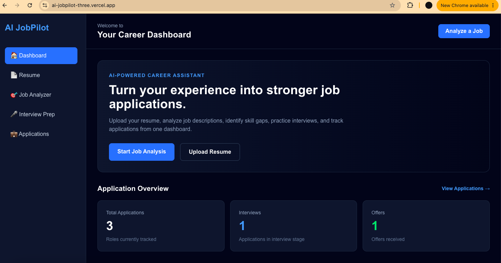
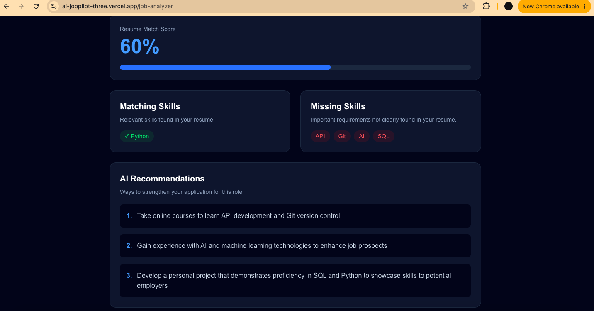
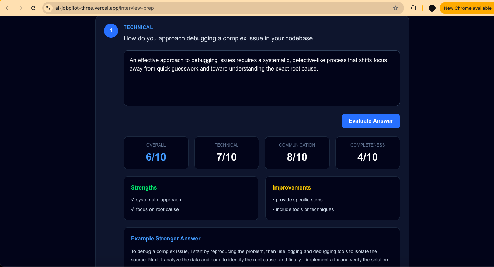
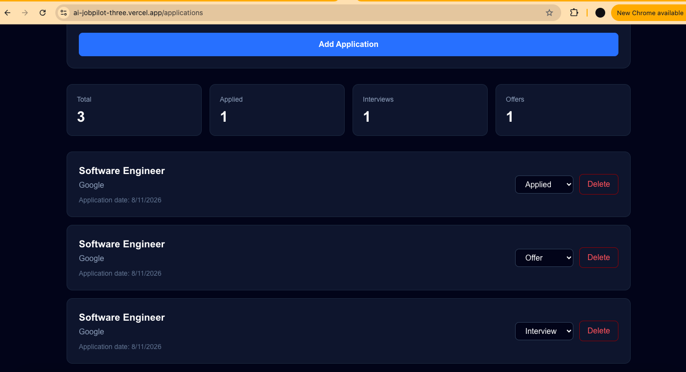

# 🚀 AI JobPilot

AI JobPilot is a full-stack AI-powered career platform designed to help job seekers analyze job opportunities, improve their resumes, prepare for interviews, and track applications from one centralized dashboard.

The application combines generative AI, resume parsing, REST APIs, and persistent PostgreSQL storage in a production-deployed Next.js application.

## 🌐 Live Demo

👉 **[Try AI JobPilot](ai-jobpilot-three.vercel.app)**

## ✨ Features

### 🎯 AI Job Analyzer

- Compare a resume against a job description
- Generate an AI-powered match score
- Identify matching skills
- Detect missing skills
- Receive personalized recommendations for improving job fit

### 📄 Resume Processing

- Upload PDF resumes
- Extract resume text automatically
- Use extracted resume information throughout the application
- Integrate resume data with AI-powered career tools

### 🎤 AI Interview Prep

- Generate interview questions based on a target job
- Practice answers directly in the application
- Receive AI-generated feedback
- Evaluate technical knowledge, communication, and completeness
- Generate suggestions for stronger responses

### 💼 Application Tracker

- Add job applications
- Track company, position, application date, and status
- Update applications through the hiring process
- Delete applications
- Persist application data in PostgreSQL
- Display live application statistics on the dashboard

## 🛠️ Tech Stack

**Frontend**
- Next.js
- React
- TypeScript
- Tailwind CSS

**Backend**
- Next.js Route Handlers
- REST API architecture
- Prisma ORM

**Database**
- PostgreSQL
- Supabase

**AI**
- Groq API
- Large Language Model integration

**Deployment & Development**
- Vercel
- Git
- GitHub
- VS Code

## 🏗️ Architecture

```text
                        AI JobPilot
                             │
              ┌──────────────┴──────────────┐
              │                             │
          Next.js UI                  Next.js APIs
              │                             │
     ┌────────┼────────┐           ┌────────┴────────┐
     │        │        │           │                 │
  Resume     Job    Interview    Groq AI          Prisma
  Parser   Analyzer    Prep                          │
                                                    │
                                              PostgreSQL
                                                    │
                                                 Supabase
```

## 🔄 Application Tracker API

AI JobPilot implements persistent CRUD operations through REST-style API endpoints.

| Method | Endpoint | Purpose |
|---|---|---|
| `GET` | `/api/applications` | Retrieve applications |
| `POST` | `/api/applications` | Create an application |
| `PATCH` | `/api/applications/[id]` | Update application status |
| `DELETE` | `/api/applications/[id]` | Delete an application |

## 🧠 What I Learned

Building AI JobPilot gave me hands-on experience integrating frontend, backend, database, and AI technologies into one production application.

Key areas included:

- Designing reusable React and TypeScript components
- Building REST API endpoints with Next.js
- Integrating generative AI into application workflows
- Parsing and processing PDF resume data
- Designing persistent CRUD functionality
- Working with Prisma ORM and PostgreSQL
- Connecting a cloud-hosted Supabase database
- Managing environment variables and API credentials securely
- Debugging development versus production behavior
- Deploying and testing a full-stack application on Vercel
- Using Git and GitHub throughout the development lifecycle

## 🔐 Environment Variables

The application requires the following environment variables:

```env
GROQ_API_KEY=
DATABASE_URL=
DIRECT_URL=
```

> API keys and database credentials are never committed to the repository.

## 💻 Run Locally

Clone the repository:

```bash
git clone https://github.com/trinityray02/ai-jobpilot.git
cd ai-jobpilot
```

Install dependencies:

```bash
npm install
```

Generate Prisma Client:

```bash
npx prisma generate
```

Start the development server:

```bash
npm run dev
```

Then open:

```text
http://localhost:3000
```

## 🚀 Production

AI JobPilot is deployed on Vercel with PostgreSQL infrastructure provided by Supabase.

Production environment variables are securely configured through Vercel.

## 📸 Screenshots

### Dashboard




### AI Job Analysis




### Interview Preparation




### Application Tracker




## 🔮 Future Improvements

Potential future enhancements include:

- User authentication
- Individual user accounts
- Saved AI job analyses
- Interview practice history
- Application analytics and visualization
- Automated resume recommendations
- Job-search integrations

## 👩🏽‍💻 Author

**Trinity Ray**

Software Engineer focused on building practical full-stack applications that combine modern web technologies, APIs, databases, and artificial intelligence.

---

⭐ If you found AI JobPilot interesting, consider starring the repository.